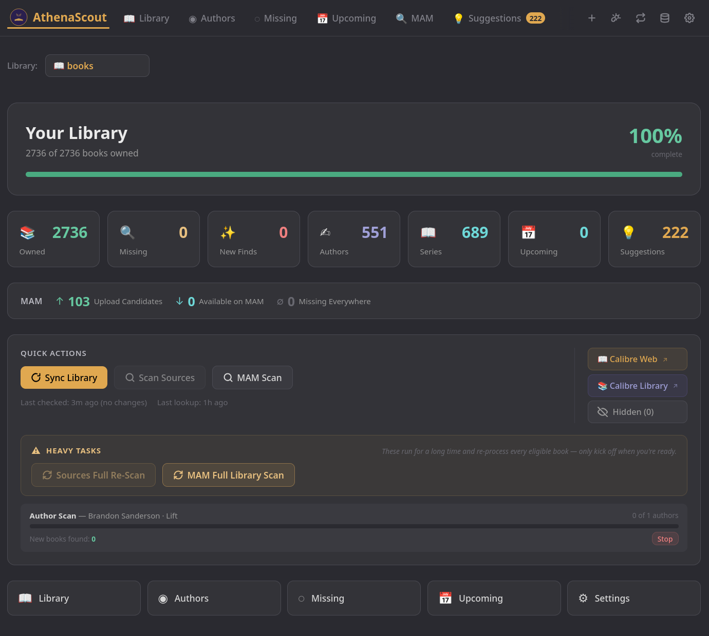
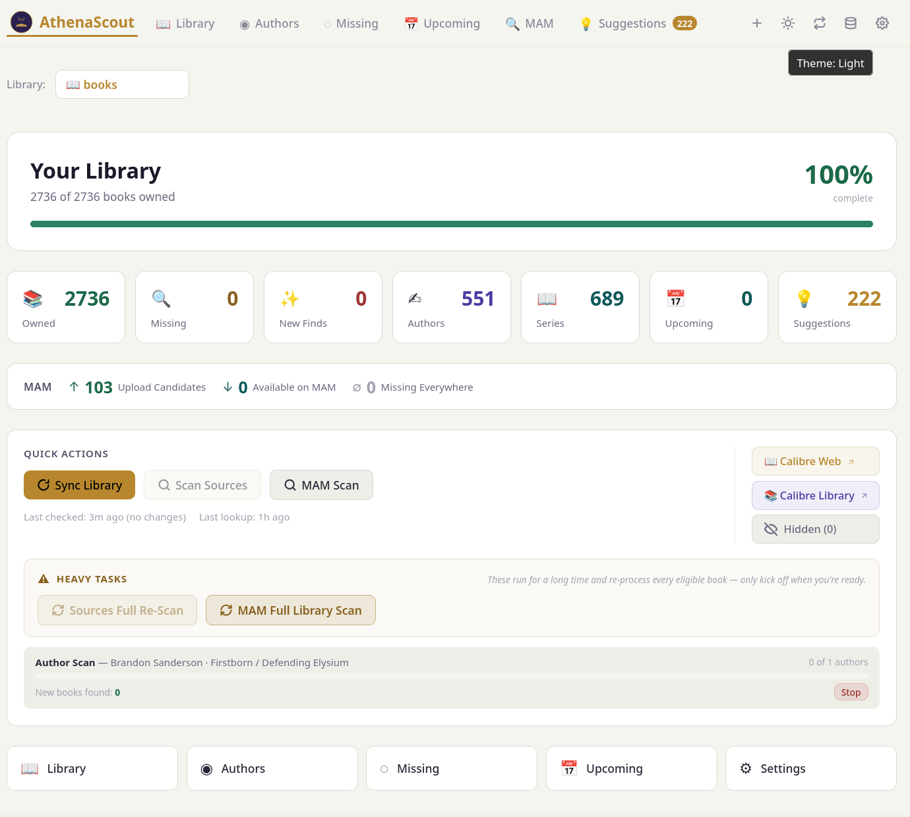
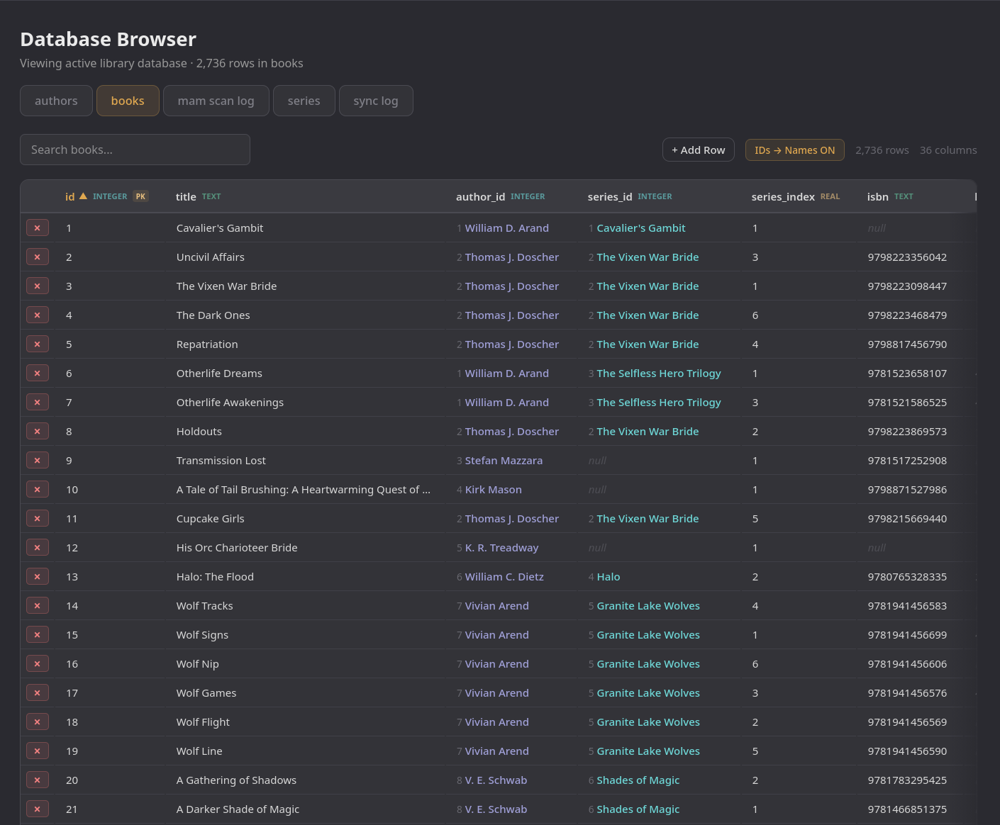

<div align="center">

# 📚 AthenaScout

**Self-hosted ebook discovery for your Calibre library**

[](https://github.com/mnbaker117/AthenaScout/releases)
[](https://github.com/mnbaker117/AthenaScout/pkgs/container/athenascout)
[](LICENSE)
[](https://www.python.org/)
[](https://react.dev/)



</div>

---

## 👋 Hey, I made this because I wanted it to exist

I run a Calibre library. I collect specific authors and series, and I
care a lot about whether I'm actually *complete* — every book in
every series, every novella, every novel by every author I care
about. And I could not find a tool that did this well.

So I built one. AthenaScout reads your Calibre library, scans
external metadata sources for the authors and series you collect,
tells you exactly what you're missing, and (optionally) cross-references
the gaps against MyAnonamouse so you know what's actually
downloadable.

It's niche. It's opinionated. It exists because I wanted it to
exist. If you're the same kind of "I need to know what I'm missing"
collector, I think you'll like it. **Please enjoy.**

---

## ✨ What it does

| | Feature | Description |
|---|---|---|
| 📚 | **Library sync** | Reads your existing Calibre `metadata.db` directly. Read-only. No re-tagging, no parallel database to maintain. The sync layer is backend-agnostic — Calibre is the only supported backend today, but the [`LibraryApp`](app/library_apps/base.py) interface is built to grow. |
| 🗂️ | **Multi-library** | Point at a parent directory and AthenaScout discovers every Calibre library inside it. Switch between them from the dashboard. |
| 🔍 | **Six metadata sources** | Goodreads, Hardcover, and Kobo are on by default; Amazon, IBDB, and Google Books are opt-in. Each contributes different signals — Amazon for series confirmation, IBDB for ISBN coverage, Google Books for descriptions — and the merge layer reconciles conflicts with field-level rules. |
| 🎯 | **Author + series scanning** | Find every book an author has written, every entry in a series, and exactly which ones you're missing. Library-only mode lets you enrich your existing books without adding discovery noise. |
| 👥 | **Pen-name + co-author linking** | Link two authors as pen names of the same person *or* as habitual co-authors. Source scans for either side dedup books across the linked identities, so William D. Arand ↔ Randi Darren and J.N. Chaney's collab catalog stop creating duplicate rows. |
| 💡 | **Series-consensus suggestions** | When 2+ sources disagree with your stored series data, AthenaScout writes a *suggestion* you can review and Apply or Ignore — never a silent overwrite. |
| 📦 | **Omnibus detection** | Compilations and box-sets that match a known series name are flagged as `is_omnibus` and rendered separately so they don't shift series numbering. |
| 🎫 | **MAM integration (optional)** | Cross-reference missing books against MyAnonamouse with confidence-scored matching, format priority, multi-language scanning, scheduled background scans, and **automatic session-cookie rotation** so you stop having to re-paste tokens every two weeks. |
| 🚀 | **Send to Hermeece** | One-click hand-off of a found MAM match to a [Hermeece](https://github.com/mnbaker117/Hermeece) instance for automatic download + Calibre import. Available from the book sidebar, the per-row MAM page button, and bulk multi-select. |
| 🔔 | **ntfy notifications** | Optional push notifications via [ntfy.sh](https://ntfy.sh) for scan completions, MAM hits, library sync, Hermeece sends, and cookie rotations. Toggle per event, or batch into a daily/weekly digest. |
| 📊 | **Live unified scan widget** | Library sync, source scans, and MAM scans all surface in a single Dashboard widget with per-book progress and per-row Stop buttons — even when multiple scans run concurrently. |
| 📋 | **In-app log viewer** | Color-coded, searchable, auto-scrolling viewer over the last 2000 log lines. Diagnose a stuck scan or a misbehaving source without `docker logs`. |
| 🛠️ | **Database editor** | Built-in browser/editor for AthenaScout's SQLite databases. Inline cell editing with foreign-key resolution. |
| 🔐 | **Encrypted credential store** | MAM session token + Hardcover API key are stored Fernet-encrypted in a dedicated auth DB, keyed off a host-side `auth_secret` file (0600 perms). Single-admin auth with bcrypt passwords, signed session cookies, and brute-force lockout. |
| 🎨 | **Three themes** | Light, dark, and dim. Inline-styled React, no CSS framework bloat. |
| 🐳 | **Docker or native** | Official Docker image for self-hosters, plus PyInstaller binaries for Linux, Windows, and macOS desktops. |
| 📥 | **Import / export** | Bulk-import books from a list of Goodreads/Hardcover URLs with full metadata, or export the current library as JSON. |

---

## 🎨 Themes

<div align="center">



*Light · Dark · Dim — switchable from the dashboard at any time.*

</div>

---

## 🚀 Quickstart (Docker)

```yaml
services:
  athenascout:
    image: ghcr.io/mnbaker117/athenascout:latest
    container_name: athenascout
    ports:
      - "8787:8787"
    volumes:
      - /path/to/your/calibre:/calibre:ro
      - /path/to/athenascout/data:/app/data
    restart: unless-stopped
```

Then open `http://your-server:8787` and follow the first-run wizard
to create your admin account.

For multi-library setups, the `CALIBRE_EXTRA_PATHS` rules, Unraid
notes, and the full env-var reference, see
[`docs/setup-docker.md`](docs/setup-docker.md).

Not running Docker? See [`docs/setup-standalone.md`](docs/setup-standalone.md)
for native binaries on Linux, Windows, and macOS.

---

## 📖 Documentation

| Topic | Doc |
|---|---|
| 🗂️ Browse all docs | [`docs/`](docs/README.md) |
| 🚀 First-run walkthrough | [`docs/first-run.md`](docs/first-run.md) |
| 🐳 Docker / Unraid setup | [`docs/setup-docker.md`](docs/setup-docker.md) |
| 💻 Standalone (Linux / Windows / macOS) | [`docs/setup-standalone.md`](docs/setup-standalone.md) |
| 🎫 MyAnonamouse integration | [`docs/mam-integration.md`](docs/mam-integration.md) |
| 🔐 Authentication & deployment patterns | [`docs/auth-deployment.md`](docs/auth-deployment.md) |
| 🛡️ Security policy | [`SECURITY.md`](SECURITY.md) |

---

## 🛠️ Power-user features

<div align="center">



*The built-in database editor lets you inspect and tweak any AthenaScout table inline, with foreign-key resolution.*

</div>

The database editor, the bulk import/export flows, the per-book and
per-author MAM rescans, the series-consensus suggestion review queue,
the source-priority merge layer with field-level protection for your curated library data
— there's a lot under the hood for the kind of person who wants their
library to be exactly correct. Most of it is documented inline in the
[first-run walkthrough](docs/first-run.md); the rest is discoverable
from the UI.

---

## 📋 Requirements

- An existing **Calibre library** (AthenaScout reads from your
  existing `metadata.db` — it doesn't manage Calibre itself, and it
  never writes to your Calibre database)
- **Docker + Docker Compose** *or* a Linux/Windows/macOS host for
  the standalone build
- *Optional:* a **MyAnonamouse account** with a session token if you
  want MAM cross-referencing
- *Optional:* a free **Hardcover API key** from [hardcover.app](https://hardcover.app)
  if you want Hardcover as one of your sources (recommended — they
  have the cleanest API of the three)

---

## 🤝 Contributing

There's no formal contributor guide yet, but PRs and issues are
welcome. The code is heavily commented where it counts — start with
the module docstrings in
[`app/main.py`](app/main.py),
[`app/lookup.py`](app/lookup.py), and
[`app/sources/base.py`](app/sources/base.py) (the `BaseSource` contract
that any new metadata source plugin implements).

### Adding a new metadata source

If you'd like to add another metadata source (e.g. FantasticFiction,
LibraryThing, OpenLibrary), the extension point is the `BaseSource`
class in [`app/sources/base.py`](app/sources/base.py). The six
existing sources under [`app/sources/`](app/sources/) cover the
common request patterns and should give you a reference impl close
to whatever you're adding:

- `goodreads.py` — HTML scraping
- `hardcover.py` — GraphQL API
- `kobo.py` — cloudscraper-fronted Cloudflare bypass
- `amazon.py` — author-centric scraper with audiobook + junk-listing filters
- `ibdb.py` — REST API supplementary source
- `google_books.py` — public REST API supplementary source

The orchestration layer in [`app/lookup.py`](app/lookup.py) walks
sources via a typed `SourceSpec` registry with per-source timeouts
and a global per-author wall-clock budget — adding a new source
means one entry in `SOURCES` plus the `BaseSource` implementation.

### Adding a new library backend

> ⚠️ **None of the apps below are supported today.** The current
> public release ships with Calibre as the only library backend.
> They're listed here as **candidate future backends** — apps the
> framework was *designed* to accept once someone (me, eventually,
> after a long break — or you, if you want to contribute) gets
> around to writing the adapter.

The architecture is **explicitly designed** to grow beyond Calibre.
The extension point is the `LibraryApp` interface in
[`app/library_apps/base.py`](app/library_apps/base.py); the existing
[Calibre adapter](app/library_apps/calibre.py) is the reference
implementation that any new backend can be modeled on.

Candidate **ebook** backends:

- **[Alfa](https://alfaebooks.com/)** (ebook management)
- **[Kavita](https://www.kavitareader.com/)** (ebook side)
- **[Komga](https://komga.org/)** (ebook + comics)
- **[Audiobookshelf](https://www.audiobookshelf.org/)** (ebook side)

Candidate **audiobook** backends:

- **[Audiobookshelf](https://www.audiobookshelf.org/)** (audiobook side)
- **[Kavita](https://www.kavitareader.com/)** (audiobook side)
- **[Libation](https://github.com/rmcrackan/Libation)** (Audible downloader)
- **[OpenAudible](https://openaudible.org/)** (Audible manager)

The discovery loop, sync orchestrator, scan widget, and library
switcher in the UI all hang off the registry in
[`app/library_apps/__init__.py`](app/library_apps/__init__.py) — a new
backend that implements the interface and registers itself there
"just works" without any other changes.

---

## 📜 License

See [`LICENSE`](LICENSE).

---

<div align="center">

*Built by a self-hoster, for self-hosters who actually want to know
what's missing.*

</div>
