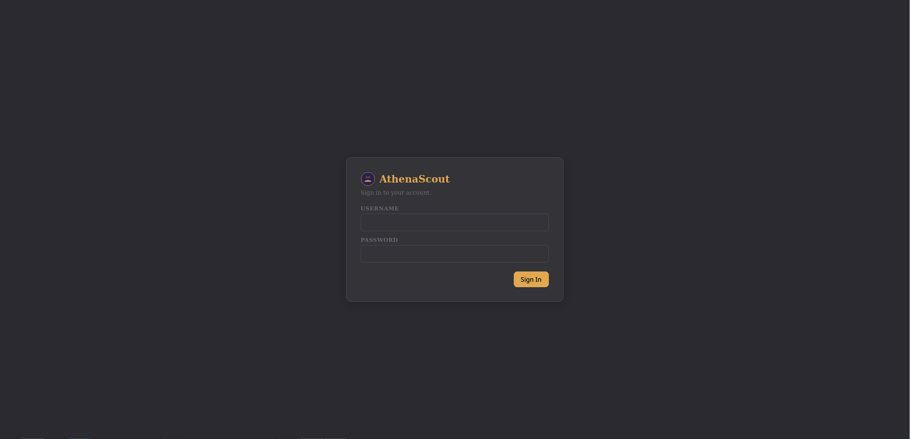

# Authentication & Deployment Patterns

AthenaScout has a single-admin authentication layer in front of every
API route. This doc explains the threat model, how the auth system
works, and three recommended patterns for deploying AthenaScout
safely.



The full security policy lives in [`SECURITY.md`](../SECURITY.md) at
the repo root — this doc is the deployment-shaped subset.

---

## Threat model

AthenaScout is designed for **a single self-hosted admin** with
**trusted network access**. The threat model assumes:

- One person uses each AthenaScout instance.
- The instance is reachable only over a trusted network — local LAN,
  a VPN, or behind a reverse proxy with HTTPS.
- An attacker reaching the login page is unwanted but the auth
  system should resist brute-force attempts.

The threat model **does not** assume:

- Multiple users sharing one instance — there's no RBAC, no per-user
  data isolation, no audit log of who did what.
- Public internet exposure without a TLS-terminating reverse proxy
  in front.
- Defense against an attacker who has already compromised the host.

If your situation requires multi-user support, public exposure
without a proxy, or a stricter security posture, AthenaScout in its
current form isn't the right tool. Open an issue if any of those
matter to you.

---

## How auth works

- **One admin account** is created via the first-run wizard. There
  is no UI to add more accounts. The username is whatever you pick;
  passwords are hashed with bcrypt and stored in
  `<data_dir>/athenascout_auth.db`.
- **Sessions** are signed cookies (via `itsdangerous`) named
  `athenascout_session`. The signing secret lives in
  `<data_dir>/auth_secret`, generated on first start with mode
  `0600`.
- **Brute-force protection** locks the admin account for a cooldown
  period after 5 failed login attempts. The lockout is global, not
  per-IP — there's only one account, so per-IP doesn't help.
- **Auth enforcement** is FastAPI middleware. Every `/api/*` route
  requires a valid signed session cookie except a small public
  allowlist:
  - `/api/health` — liveness probe (so external monitors don't need
    credentials)
  - `/api/platform` — runtime mode + OS info needed by the setup
    wizard before login
  - `/api/auth/setup`, `/api/auth/login`, `/api/auth/logout`,
    `/api/auth/check` — auth itself
- **The auth database is dedicated.** It's separate from per-library
  databases, so switching libraries does NOT log you out.
- **No password recovery.** Reset by deleting the auth database from
  inside the data directory (see
  [Docker setup](setup-docker.md#troubleshooting) or
  [standalone setup](setup-standalone.md#troubleshooting)).
- **No 2FA.** Out of scope at this size.
- **`Cache-Control: no-store`** is set on every `/api/*` response so
  browser HTTP caches and upstream proxies can't poison API URLs
  with stale `index.html` bodies — a real bug we hit once when an
  unauth'd request fell through the SPA fallback and the browser
  cached HTML against an API URL.

---

## Pattern 1: Tailscale (recommended for personal use)

The simplest secure deployment: put AthenaScout behind
[Tailscale](https://tailscale.com/) and only access it through your
tailnet.

**Why this is the recommended path:**

- Zero-config end-to-end encryption.
- No public ports exposed at all.
- Works identically across every device you own.
- No reverse proxy to maintain.
- Free for personal use.

**Setup:**

1. Install Tailscale on the host running AthenaScout.
2. Run AthenaScout normally (Docker or standalone). Don't
   port-forward `8787` from your router.
3. Access AthenaScout from any other Tailscale-connected device
   using the host's tailnet IP or its
   [MagicDNS name](https://tailscale.com/kb/1081/magicdns).

That's it. AthenaScout's auth is still active inside the tailnet —
it's a second layer beyond the network-level access control.

---

## Pattern 2: Reverse proxy with HTTPS

If you need to access AthenaScout from devices that aren't on a VPN,
put it behind a reverse proxy that handles TLS termination.

**What you need:**

- A reverse proxy: Caddy, Nginx, Traefik, NPM, or similar
- A domain name pointed at your server
- A TLS certificate (Let's Encrypt is free and most modern reverse
  proxies provision it for you)

### Caddy example

Caddy auto-provisions Let's Encrypt certs:

```caddyfile
athenascout.example.com {
    reverse_proxy localhost:8787
}
```

That's the entire config.

### Nginx example

```nginx
server {
    listen 443 ssl http2;
    server_name athenascout.example.com;

    ssl_certificate /etc/letsencrypt/live/athenascout.example.com/fullchain.pem;
    ssl_certificate_key /etc/letsencrypt/live/athenascout.example.com/privkey.pem;

    location / {
        proxy_pass http://localhost:8787;
        proxy_set_header Host $host;
        proxy_set_header X-Real-IP $remote_addr;
        proxy_set_header X-Forwarded-For $proxy_add_x_forwarded_for;
        proxy_set_header X-Forwarded-Proto $scheme;
    }
}
```

Plus a separate `:80` block that redirects HTTP → HTTPS.

### Hardening tips

- Bind AthenaScout to `127.0.0.1` so it's not directly reachable
  from the LAN, only via the proxy. For Docker, use
  `127.0.0.1:8787:8787` instead of `8787:8787` in the `ports:`
  section.
- Enable HTTP-to-HTTPS redirect at the proxy level.
- Consider adding [Authentik](https://goauthentik.io/) or
  [Authelia](https://www.authelia.com/) in front for an additional
  auth layer if you want defense in depth.
- Don't disable AthenaScout's own auth even if you have an SSO layer
  in front. There's no supported way to do this anyway, and the
  belt-and-suspenders posture is the right call.

---

## Pattern 3: Trusted private LAN

If AthenaScout will only ever be accessed from your home LAN and
never from outside, you can run it as-is with no reverse proxy and
no VPN. The single-admin auth is sufficient for this case.

**Recommended even on a trusted LAN:**

- Use a strong password on the admin account.
- Don't port-forward `8787` from your router. Ever.
- Periodically check your container/standalone logs for failed
  login attempts (they're visible in stdout).

**This is the simplest pattern but the most exposed if anything
goes wrong** — a compromised IoT device on your LAN, a misconfigured
router, an open VPN tunnel, etc. For most users, Tailscale (Pattern
1) is barely more work and dramatically more robust.

---

## What NOT to do

- **Don't put AthenaScout directly on the public internet without a
  reverse proxy.** Even with auth enabled, you're trusting the
  implementation to be perfect against every drive-by scanner on the
  internet. Use Tailscale or a reverse proxy with HTTPS.
- **Don't share your admin credentials.** There's no audit log; it's
  a single-admin app by design.
- **Don't disable auth.** There's no supported way to do this and
  no flag for it.
- **Don't store your data directory on a network share that other
  users can read.** The auth secret and session cookies are
  sensitive.

---

## Auditing your setup

After deploying, run through this checklist:

- [ ] AthenaScout is reachable from where you need it and ONLY from
      where you need it
- [ ] You can log in with your admin credentials
- [ ] You've tested the lockout: 5 wrong passwords in a row should
      temporarily lock the account
- [ ] If using HTTPS: the certificate is valid and auto-renews
- [ ] If using a VPN: the AthenaScout port is not also exposed via
      your router
- [ ] Your data directory permissions don't allow other host users
      to read it (the Docker image creates it `0700` automatically)
- [ ] You know how to reset your admin password if you lose it

If anything in that list isn't satisfied, fix it before relying on
the deployment.

---

## Reporting security issues

Security issues should be reported as described in
[`SECURITY.md`](../SECURITY.md). Please don't file public GitHub
issues for vulnerabilities.
