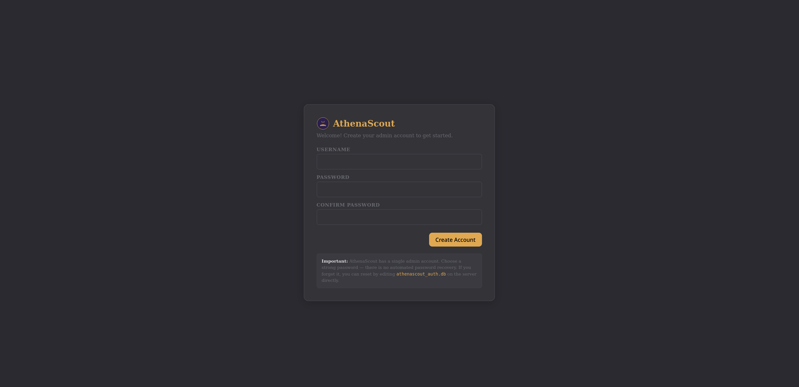
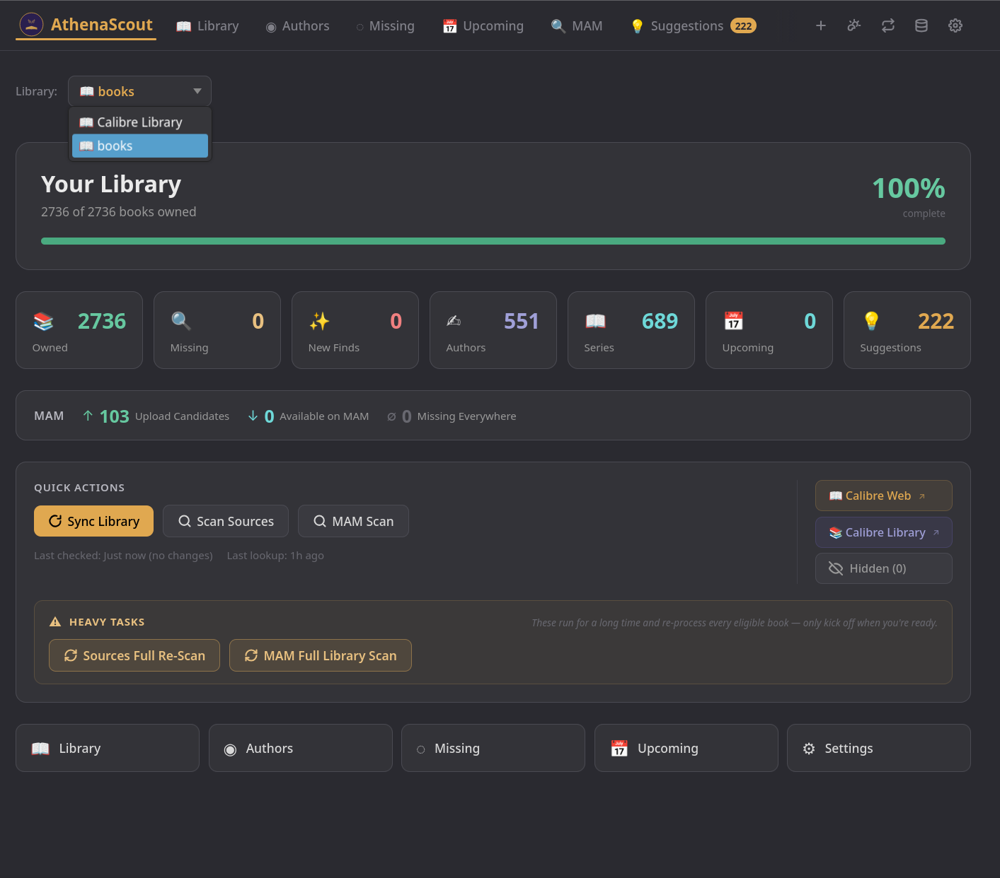
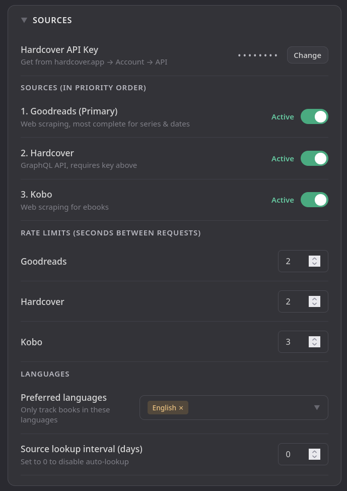
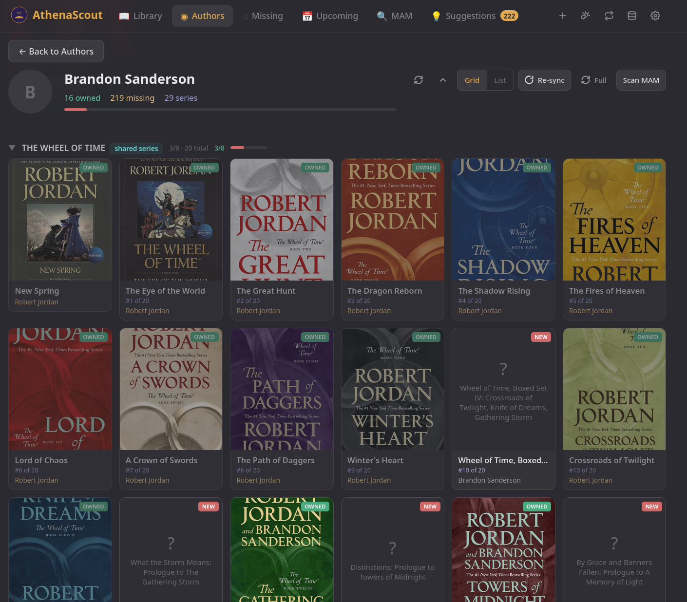
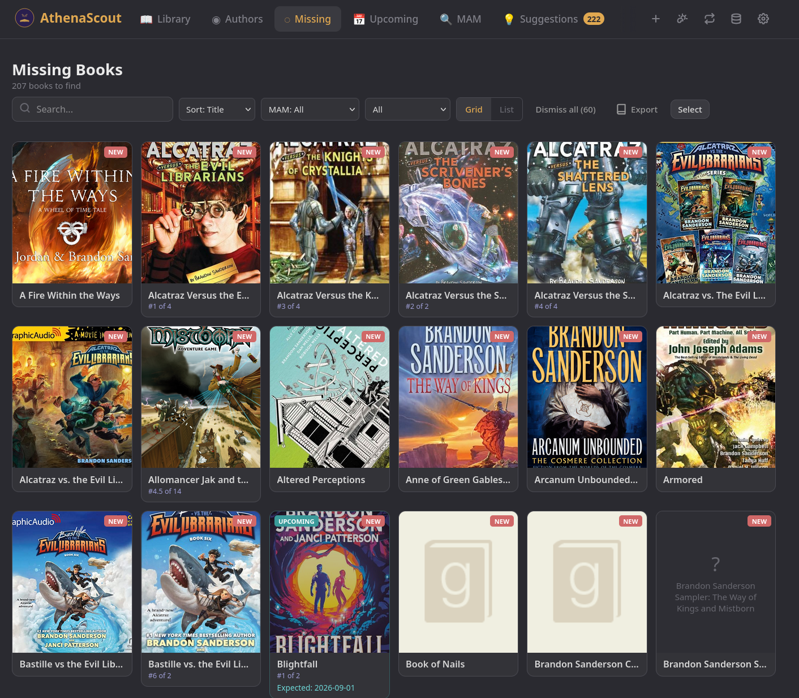
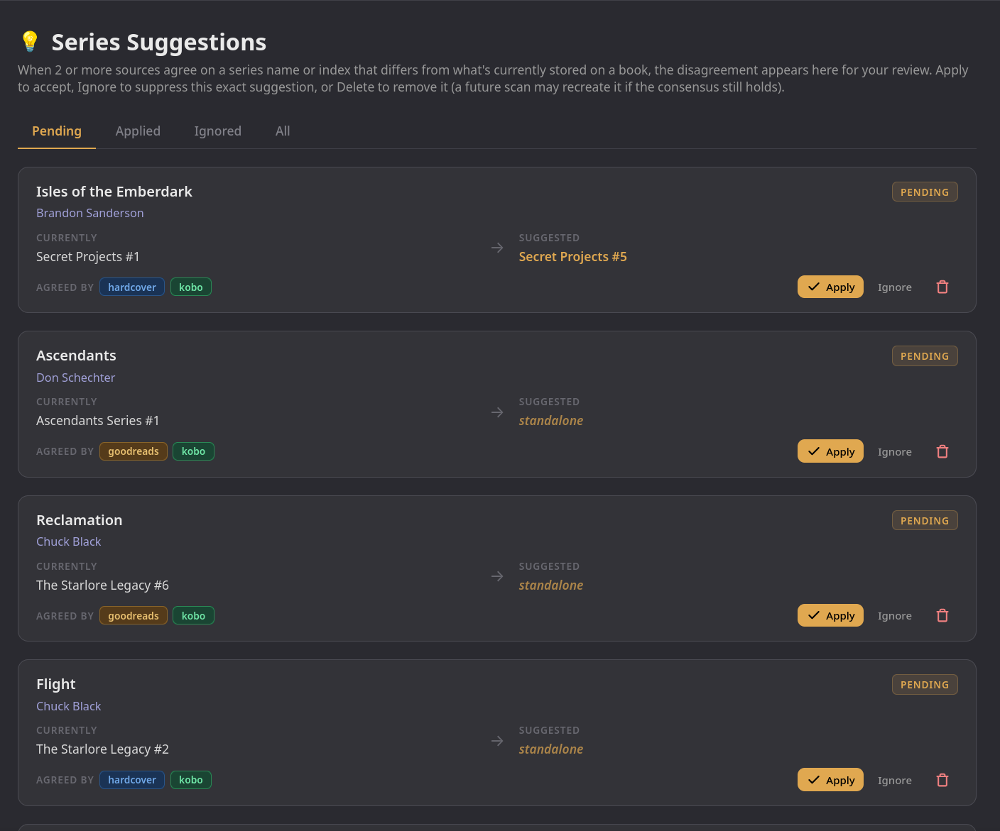

# First-Run Walkthrough

This walks you from "AthenaScout is running and I'm staring at a
login screen" all the way to "I just finished my first scan and I
can see what's missing from my library."

If you haven't installed AthenaScout yet, start with
[Docker setup](setup-docker.md) or
[standalone setup](setup-standalone.md).

---

## 1. Create your admin account

Open AthenaScout in your browser (default: `http://your-server:8787`).
On a fresh install you'll see the **first-run wizard** asking you to
create an admin username and password.

- **Username:** any string. Used only for login.
- **Password:** there's no minimum length enforced, but pick something
  strong if AthenaScout will be reachable from anywhere beyond
  `localhost`. Passwords are hashed with bcrypt and never stored in
  plaintext.

Click **Create Account**. You're logged in automatically and dropped
into the second half of the wizard.

> 💡 AthenaScout uses single-admin authentication. There's only ever
> one account. If you lose the password, see the password reset
> instructions in [Docker setup](setup-docker.md#troubleshooting) or
> [standalone setup](setup-standalone.md#troubleshooting).

---

## 2. Register your Calibre library (or libraries)

The setup wizard's next step lets you point at your Calibre
library or libraries. You can:

- **Pick from auto-discovered locations** if AthenaScout already found
  one via the `CALIBRE_PATH` env var (Docker) or the OS-default
  Calibre Library location (standalone).
- **Browse to a metadata.db** if it's somewhere unusual.
- **Add a discovery root** — point at a parent directory and
  AthenaScout will register every Calibre library inside it.

You can register more than one library here. They'll all show up in
the dashboard's library switcher and each gets its own scan history,
settings, and book database.

Click **Validate** to make sure each path resolves before moving on.
A failed validation almost always means a typo or a path that doesn't
contain a `metadata.db`.

> 💡 You can skip the wizard's library step entirely if you want to
> configure libraries later from **Settings → Library Sources**.

---

## 3. (Optional) Drop in API keys

The wizard's third step gives you two optional integrations:

- **Hardcover API key** — get one free from
  [hardcover.app](https://hardcover.app) → Account → API. AthenaScout
  works without it (Goodreads + Kobo are still active), but Hardcover
  has the cleanest API of the three sources and is worth enabling.
- **MyAnonamouse session token** — only relevant if you have a MAM
  account. See the [MAM integration guide](mam-integration.md) for
  the full setup. You can also leave this empty and configure it
  later from Settings.

Both fields are optional. The wizard's **Skip** button finishes the
flow with whatever you've entered (or nothing).

---

## 4. Initial sync

When you click **Finish**, the wizard:

1. Saves your settings.
2. Re-discovers libraries.
3. Runs the first Calibre sync (read-only — it's pulling FROM your
   `metadata.db`, not writing to it).

This is the only time you'll see a blocking progress screen. After
sync finishes you land on the dashboard.

---

## 5. The dashboard

The dashboard is the home base. From top to bottom:

- **Library switcher** — only visible if you have more than one
  library. Switching libraries cancels any in-flight scans cleanly
  before swapping.
- **Library stats** — owned books, missing books, authors, series,
  upcoming releases, and (when there are pending series suggestions)
  a Suggestions card.
- **Unified scan widget** — empty when nothing has run, but as soon
  as you kick off a library sync, source scan, or MAM scan it shows a
  live row per active scan with progress bar, current item, and a
  per-row Stop button. Multiple scans can show side-by-side.
- **Quick actions** — buttons to trigger sync, source scans, and the
  MAM scan if MAM is enabled.

If you have multiple libraries, the switcher is in the top-left:

---

## 6. Configure your sources

Go to **Settings → Sources**.

You'll see four metadata sources, each with its own enable toggle and
rate-limit setting:

| Source | What it provides | Setup |
|---|---|---|
| **Goodreads** | Author bibliographies, series detection, publication dates, language filtering. Primary source — its data wins conflicts with the others. | None (public scraper) |
| **Hardcover** | Author bibliographies via real GraphQL API. Best at series taxonomy. | Free API key from [hardcover.app](https://hardcover.app) |
| **Kobo** | Modern ebook catalog with reliable publication dates and ISBNs. | None (public scraper, behind Cloudflare) |
| **MyAnonamouse** | Cross-references missing books against MAM's catalog so you know what's actually downloadable. Optional. | Session token — see [MAM integration](mam-integration.md) |

For your first scan, leave Goodreads + Hardcover + Kobo on and skip
MAM if you don't use it. You can always toggle sources later.

> 💡 **Library-only mode** is the option labeled "Only enrich owned
> books". When enabled, source scans fill in missing metadata on the
> books you already have but don't add new "missing" or "upcoming"
> book rows. Useful if you want to polish your existing library
> before turning the discovery firehose on.

Click **Save**.

---

## 7. Run your first author scan

Navigate to **Authors**. You'll see every author in your Calibre
library, sorted alphabetically by default. The list hides "orphan"
authors who have zero linked books — typically secondary co-authors
of multi-author Calibre rows that don't have any books listed under
them as primary author.

Pick an author you collect actively — ideally one with a known
multi-book series — and click them. On the author detail page, click
**Re-Sync**.

What happens:

1. AthenaScout queries each enabled source for the author's full
   bibliography.
2. The merge layer reconciles results across sources, with Goodreads
   winning conflicts.
3. Owned books get their metadata enriched (descriptions, page
   counts, ISBNs filled in if Calibre didn't have them).
4. Books AthenaScout found that you don't own become **Missing**.
5. Books with future release dates become **Upcoming**.

The unified scan widget on the dashboard shows the scan ticking
through each book in real time, with the current title underneath
the progress bar. You can switch back to the dashboard mid-scan to
watch it work.

When the scan finishes, the author detail page shows owned, missing,
and upcoming sections, grouped by series:

The **Full Re-Scan** button next to Re-Sync visits every book page
to refresh stale metadata. It's slower but gets you fresh
descriptions, page counts, and edition dates from the sources.

Repeat for any other authors you care about. AthenaScout caches
results, so re-running a scan within the cache window is a no-op.

---

## 8. Check your overall missing list

Navigate to **Missing**. This is the aggregated view of every missing
book across every author you've scanned. Filter by series, sort by
title / author / publication date, and click any row to open the book
sidebar with full details.

This is the page most users live in. It's the answer to *"what should
I be hunting for?"*

The **Upcoming** page is the same view filtered to books with a
future release date — useful for keeping tabs on what's about to land
from the authors you follow.

---

## 9. Source-consensus suggestions

If two or more sources agree on a series name or position that
disagrees with what's currently stored on a book, AthenaScout doesn't
silently overwrite — it writes a **suggestion** to the Suggestions
page for you to review.

A "Suggestions" nav item appears in the top bar with a count badge
when there are pending suggestions. Click in to see them:

For each row, you can:

- **Apply** — write the consensus value back to the book.
- **Ignore** — suppress this exact suggestion forever (a future scan
  with a NEW disagreement will still get a fresh suggestion).
- **Delete** — drop the row entirely.

This is what catches stuff like "Calibre says #4 but Goodreads,
Hardcover, and Kobo all say #5" — you stay in control of every edit
to your library.

---

## 10. (Optional) Set up MAM

If you have a MyAnonamouse account, follow the
[MAM integration guide](mam-integration.md). Once configured, the MAM
page shows a tabbed view of upload candidates (books you own that MAM
doesn't), download candidates (books MAM has that you don't), and
"missing everywhere" books (you don't have them and MAM doesn't
either).

---

## 11. (Optional) Tune scheduled scans

Open **Settings** and scroll to the **Scheduling** section. The three
periodic jobs are:

- **Library sync** — re-imports from your active library backend
  (Calibre's `metadata.db` today). Runs every 60 minutes by default.
  Set to `0` to disable.
- **Author scans** — re-scans authors whose last lookup is older than
  the cache window. Default: every 3 days. The cache window itself is
  configurable on the same page.
- **MAM scans** — only runs when MAM is enabled. Default: every 6
  hours. Each tick processes one batch of 150 books and stops; the
  next tick picks up where the last one left off.

Sensible starting cadences for most users:

- Library sync: hourly
- Author rescans: every few days
- MAM: every 4–6 hours if you use it heavily, daily otherwise

---

## You're done

That's the entire core workflow. From here, things worth exploring:

- **Series page** — every series you have at least one book in, with
  owned-vs-total counts and a clickable detail view.
- **Hidden books page** — anything you've hidden via the "Hide"
  action elsewhere in the app. Hidden books still get their metadata
  refreshed on full re-scans, so they stay current if you ever
  unhide them.
- **Database editor** — Settings icon → Database. A power-user
  browser for the active library's SQLite database, with inline
  cell editing and FK resolution. Use sparingly.
- **Import/Export** — the icon next to Database in the top bar.
  Paste a list of Goodreads/Hardcover URLs to bulk-import books with
  full metadata, or export the current library as JSON.
- **Auth deployment patterns** — read the
  [auth deployment doc](auth-deployment.md) before exposing
  AthenaScout beyond your local network.

If you hit a bug or have a feature suggestion,
[file an issue](https://github.com/mnbaker117/AthenaScout/issues).
