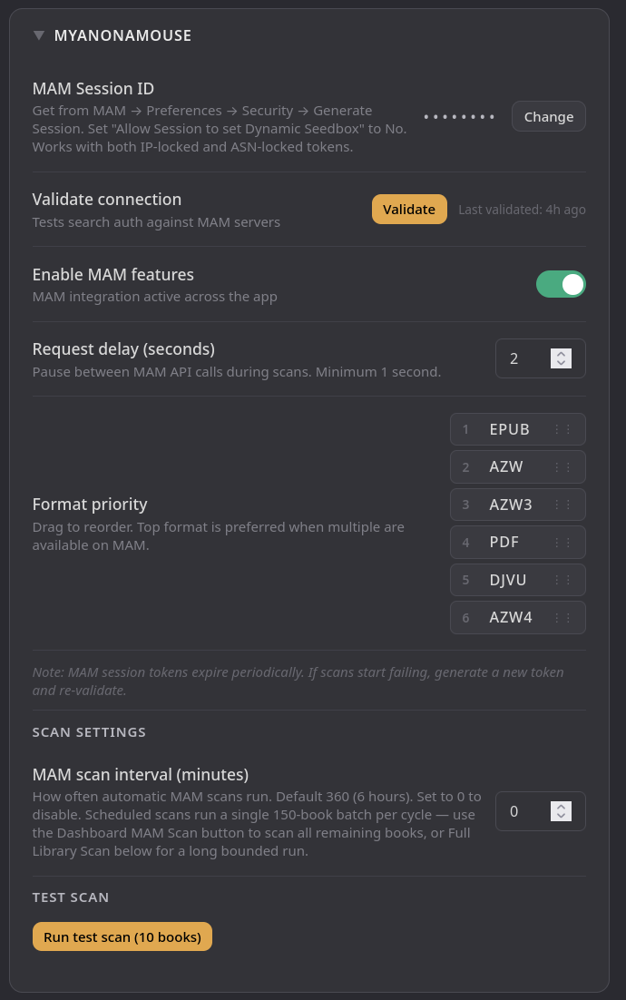
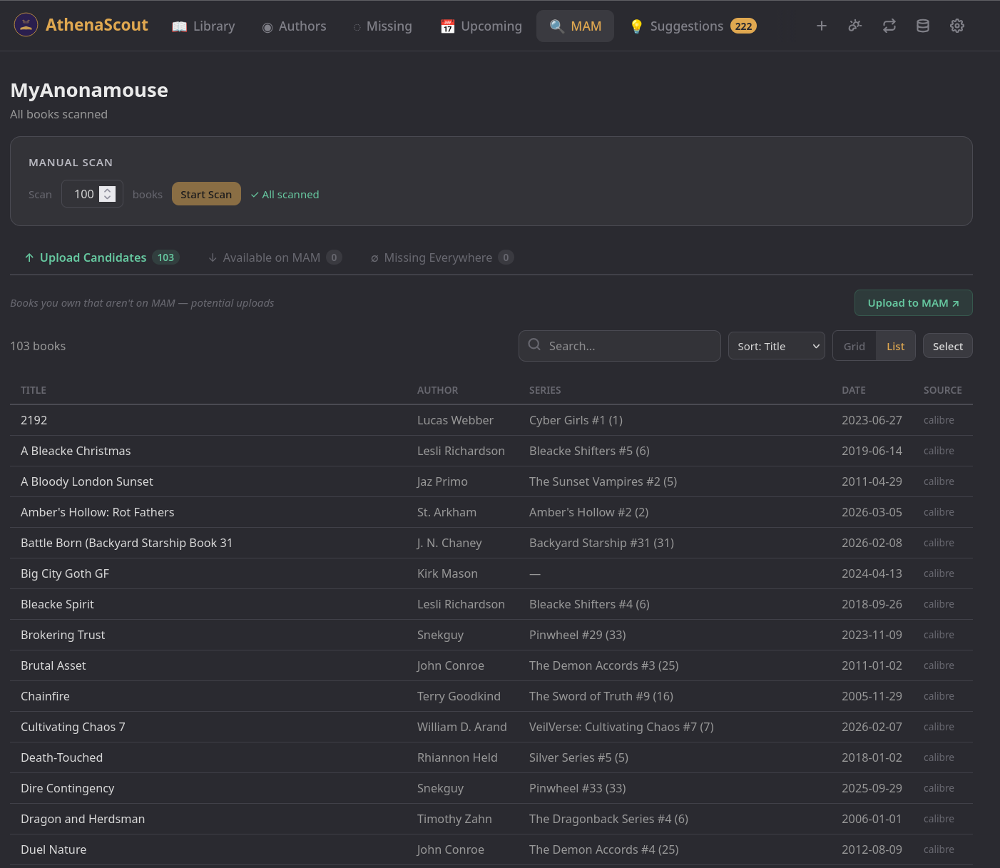

# MyAnonamouse (MAM) Integration

MAM integration is optional. When enabled, AthenaScout cross-references
your library against MAM's catalog so you can see — without leaving
the AthenaScout UI — which missing books are currently downloadable,
which of your owned books would be useful uploads, and which are
missing from both your library AND MAM.

## Requirements

- An active MyAnonamouse account
- A current MAM session token (the `mam_id` or `mbsc` cookie that you have created in Preferences -> Security)

If you don't have a MAM account, skip this doc — AthenaScout works
fine on Goodreads + Hardcover + Kobo alone.

---

## Getting your session token

1. Log in to MyAnonamouse in your browser.
2. Go to Sessions / Create session settings (`Profile -> Preferences -> Security`).
3. Create a session (IP or ASN locked) and set `Allow Session to set Dynamic Seedbox` to `No`.
4. Give session a label or note for its usage (Optional)
5. Once created, Click the `View ASN/Ip address locked session cookie` button.
6. Copy the entire value. It's a long string.

> 🔐 **Treat this token like a password.** It grants full account
> access. AthenaScout stores it in `settings.json` inside your data
> directory. That directory is created with restrictive permissions
> automatically, but make sure you don't accidentally back it up to
> public storage.

> 💡 **Note on seedbox sessions:** AthenaScout never updates your MAM
> IP via these calls (`mam_skip_ip_update` is hardcoded `True`). It
> won't bump your active seedbox session.

---

## Configuring AthenaScout

1. In AthenaScout, go to **Settings → Sources → MyAnonamouse**.
2. Toggle **Enable MAM** on.
3. Paste your `mam_id` value into the **Session Token** field.
4. Click **Validate**. AthenaScout fires a low-impact request and
   reports back whether the token is accepted.

If validation fails, the most common cause is a stale token. Tokens
rotate when you log in from a new IP or after a long time. Re-grab
the session cookie from your MAM Security settings and try again.

---

## Format priority

In **Settings → Sources → MyAnonamouse → Format Priority**, you can
drag-and-drop the order in which formats are preferred. AthenaScout
considers a book "available" if MAM has it in any format, but the
priority controls which one is shown first in the UI when a book has
multiple format options.

Default order: `epub → azw → azw3 → pdf → djvu → azw4`.

Reasonable variations:

- **Pure EPUB collector:** `epub` first, leave the rest at default
- **Kindle-leaning:** `azw3 → azw → epub → mobi → pdf`
- **Format-agnostic:** doesn't matter, default works fine

---

## Languages

AthenaScout supports multi-language MAM filtering. By default, only
English is enabled. To include additional languages in scans:

1. Go to **Settings → Sources → MyAnonamouse → Languages**.
2. Toggle on the languages you want.
3. Save.

The languages list is restricted to languages we have verified MAM
language IDs for (English, Spanish, Dutch, Hungarian, French,
Italian, Portuguese). If you want a language that isn't in the list,
[file an issue](https://github.com/mnbaker117/AthenaScout/issues) —
we deliberately don't guess at IDs we haven't verified, because a
wrong ID silently pulls results in an unrelated language.

> 💡 If you only collect English books, leave this alone. The default
> works for the majority of users.

---

## Running scans

Three flavors, all triggered from the UI:

### Single book

In the book sidebar (any page that lists books), click the **Re-scan
MAM** button. Useful for spot-checking a stale or wrong match without
waiting for a scheduled scan.

### Single author

On the author detail page, click **Scan MAM**. Runs through every
un-scanned book by that author and surfaces results in the unified
Dashboard scan widget. The Stop button on the widget cancels mid-run.

### Full library

From the dashboard or **Settings → MAM → Run Manual Scan**, the
manual MAM scan chips through every book missing MAM data in 150-book
batches with a 1-minute pause between batches. The Dashboard widget
shows progress per book.

You can also kick off a **Full MAM Scan** from Settings — that's the
heavyweight version that runs 400 books per batch with a 5-minute
pause and persists state across restarts via the `mam_scan_log`
table. Use it if you've added a lot of books and want to catch up
quickly.

> 💡 **MAM shows EVERY attempt** in the per-book progress feed,
> unlike source scans which hide filter-noise (foreign-language
> editions, set/collection titles, etc.). MAM has no equivalent
> noise to filter, so the feed is one tick per book the scanner
> actually checks.

---

## Scheduled scans

In **Settings → Scheduling → MAM scan interval**, set how often
AthenaScout should automatically check MAM for missing books. Each
tick runs one bounded batch — same code path as the manual scan,
just one batch at a time.

Recommended cadence:

- **Heavy MAM users:** every 4–6 hours
- **Casual users:** once a day
- **Set-it-and-forget-it:** every 12–24 hours

Scheduled scans use the same five-pass cascade as manual scans
(title+author exact match → core title → subtitle right → short
title → title-only loose match) and respect your format and language
preferences.

---

## The MAM page

Click **MAM** in the main nav. The page is tabbed:

- **Upload** — books you OWN that MAM doesn't have. Useful for
  spotting upload candidates if you contribute uploads.
- **Download** — books you DON'T own that MAM has in `found` or
  `possible` status. The "what should I download right now?" view.
- **Missing Everywhere** — books you don't own AND MAM doesn't have
  either. Useful as a true gap report.

Each row links straight to the MAM torrent page so you can grab the
torrent in one click.

---

## How matching works

The five-pass cascade for each book:

1. Author + full title
2. Author + core title (volume / series prefix stripped)
3. Author + subtitle right (the part after the colon)
4. Author + short title (the part before the colon)
5. Title words only (no author, loose cleaning)

The cascade short-circuits as soon as a high-confidence match is
found. The best "possible" across all passes is kept as a fallback
when nothing hits the high-confidence threshold.

When multiple results match, AthenaScout filters to high-confidence
title matches first (≥80% match score), then ranks them by your
format priority, then by match quality, then by format count, then
by seeders. Match quality always beats format count — that's the
rule that stops a wrong-but-multi-format result from beating a
right-but-single-format match.

---

## Troubleshooting

**Validation fails with an authentication error.**
Your token is stale. Grab a fresh `mam_id` from your MAM Security settings
and re-paste.

**Validation succeeds but scans return zero results for everything.**
Check that you have at least one format enabled in **Format
Priority** and at least one language enabled in **Languages**. With
all formats or all languages disabled, no results will ever match.

**Books I know exist on MAM aren't being found.**
The cascade tries title+author exact match first and progressively
loosens. A book with an unusual title format or unusual punctuation
may slip through every pass. Two things to try:
- Hit **Re-scan MAM** on that single book and see if it lands.
- Check the book's title in your Calibre — if it's missing the
  author entirely or has a typo, fix it in Calibre, re-sync, and
  re-scan.

**MAM scans are slow.**
MAM rate-limits requests and AthenaScout respects those limits with
deliberate pacing. Large scans (hundreds of missing books) will take
several minutes by design — running faster would risk getting your
token banned.

**Settings says my session expired.**
The scheduler runs a daily background validation against your token.
If it fails, the UI surfaces a warning banner and pauses scheduled
scans until you re-validate. Grab a fresh cookie from Security settings, re-paste, click
Validate, and the warning clears.

---

## What MAM integration does NOT do

- **It does not download anything.** AthenaScout shows you what's
  available; you grab the torrent through your normal MAM workflow.
- **It does not update your MAM IP.** Safe to use alongside an active
  seedbox session — `mam_skip_ip_update` is hardcoded on.
- **It does not seed.** Discovery only.
- **It does not bypass MAM's rate limits or TOS.** Use sensibly.
